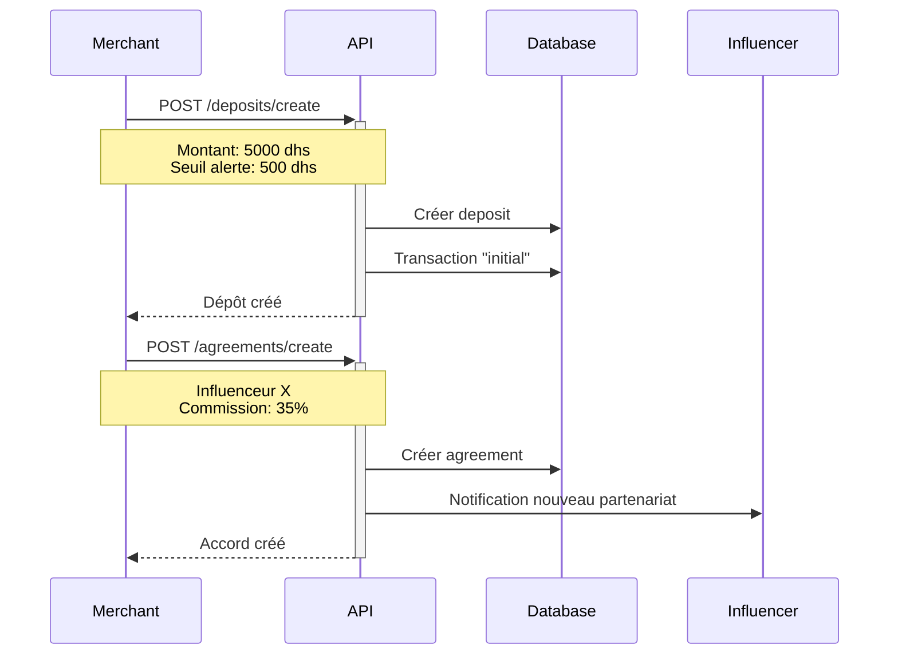
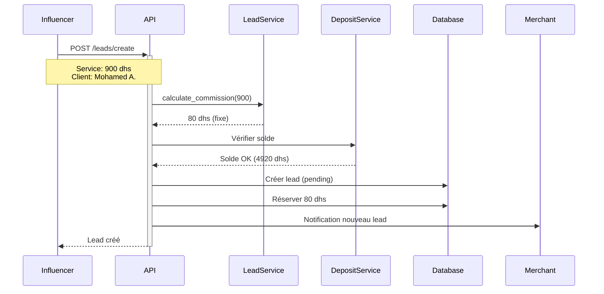
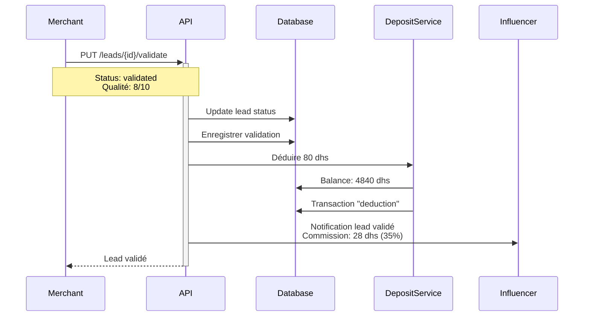
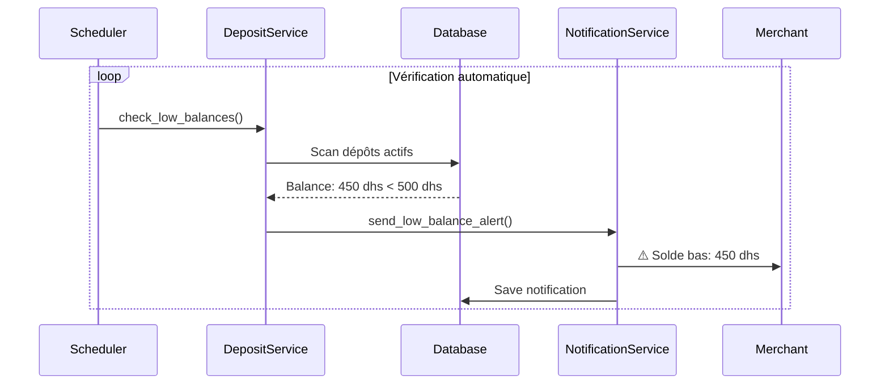
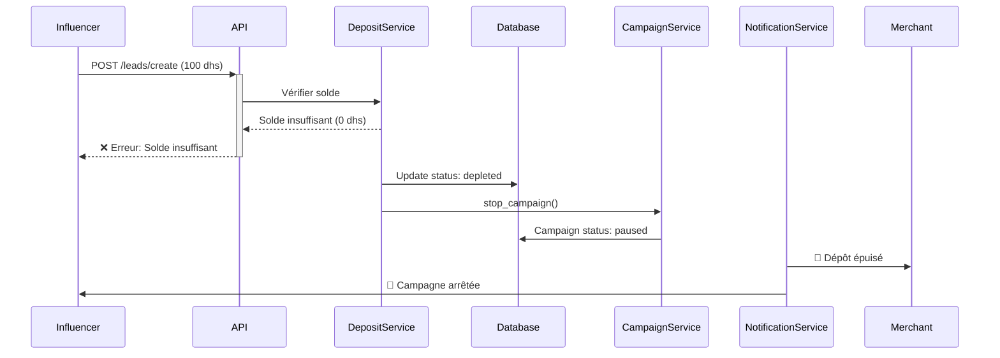

# 🎯 SYSTÈME COMPLET DE GÉNÉRATION DE LEADS - MARKETPLACE SERVICES

## 📋 SOMMAIRE

1. [Vue d'ensemble](#vue-densemble)
2. [Modèle économique](#modèle-économique)
3. [Architecture système](#architecture-système)
4. [Workflow complet](#workflow-complet)
5. [Exemples concrets](#exemples-concrets)
6. [API Reference](#api-reference)
7. [Configuration](#configuration)
8. [Guide d'intégration](#guide-dintégration)

---

## 🎨 VUE D'ENSEMBLE

### Principe

Le système LEADS permet aux **entreprises** de générer des prospects qualifiés via des **influenceurs** et **commerciaux**, sur un modèle prépayé avec dépôt.

**Différence clé avec ventes produits:**
- ❌ **Produits:** Vente directe → Commission sur vente validée
- ✅ **Services:** Génération de leads → Coût par lead généré

### Acteurs

1. **Entreprise (Merchant)**
   - Dépose des fonds (2000/5000/10000 dhs)
   - Définit les paramètres de campagne
   - Valide ou rejette les leads
   - Gère la qualité et les partenariats

2. **Influenceur/Commercial**
   - Génère des leads qualifiés
   - Négocie un % de commission avec l'entreprise
   - Suit ses performances et gains
   - Reçoit notifications sur validation

3. **Plateforme**
   - Facilite les accords
   - Gère les dépôts et transactions
   - Envoie notifications automatiques
   - Arrête campagnes si dépôt épuisé

---

## 💰 MODÈLE ÉCONOMIQUE

### Tarification Commission

#### 1. Services 50 - 799 dhs: **10% de commission**

```
Exemple: Service de 600 dhs
└── Commission plateforme: 60 dhs (10%)
    ├── Influenceur: 18 dhs (30% de 60 dhs)
    └── Plateforme: 42 dhs
```

#### 2. Services ≥ 800 dhs: **80 dhs fixe par lead**

```
Exemple: Service de 2500 dhs
└── Commission plateforme: 80 dhs (fixe)
    ├── Influenceur: 24 dhs (30% de 80 dhs)
    └── Plateforme: 56 dhs
```

**Logique:** Plus le service est cher, moins il se vend. Commission fixe = rentabilité prévisible.

### Dépôts Prépayés

| Tier | Montant | Leads estimés (800dhs) | Leads estimés (600dhs) |
|------|---------|------------------------|------------------------|
| **Basic** | 2,000 dhs | ~25 leads | ~33 leads |
| **Pro** | 5,000 dhs | ~62 leads | ~83 leads |
| **Enterprise** | 10,000 dhs | ~125 leads | ~166 leads |

### Accord Influenceur

L'influenceur/commercial négocie son pourcentage avec l'entreprise:

- **Standard:** 30% de la commission
- **Négociable:** 20% à 50% selon performance/réputation
- **Exemple:**
  ```
  Service 600 dhs → Commission 60 dhs
  Accord 40% influenceur → 24 dhs pour influenceur, 36 dhs plateforme
  ```

---

## 🏗 ARCHITECTURE SYSTÈME

### Base de données (6 tables)

#### 1. `leads` - Leads générés
```sql
- id, campaign_id, influencer_id, merchant_id
- customer_name, customer_email, customer_phone
- estimated_value (valeur du service)
- commission_amount (10% ou 80 dhs)
- commission_type ('percentage' ou 'fixed')
- influencer_percentage, influencer_commission
- status (pending, validated, rejected, converted, lost)
- quality_score (1-10)
- created_at, validated_at
```

#### 2. `company_deposits` - Dépôts prépayés
```sql
- id, merchant_id, campaign_id
- initial_amount, current_balance, reserved_amount
- alert_threshold (défaut: 500 dhs)
- auto_recharge, auto_recharge_amount
- status (active, depleted, suspended)
- depleted_at, last_alert_sent
```

#### 3. `deposit_transactions` - Historique transactions
```sql
- id, deposit_id, merchant_id, lead_id
- transaction_type (initial, recharge, deduction, refund)
- amount, balance_before, balance_after
- payment_method, payment_reference
- created_at
```

#### 4. `lead_validation` - Historique validation
```sql
- id, lead_id, merchant_id, validated_by
- previous_status, new_status
- quality_score, feedback, rejection_reason
- created_at
```

#### 5. `influencer_agreements` - Accords partenariat
```sql
- id, merchant_id, influencer_id, campaign_id
- commission_percentage (30%, 40%, etc.)
- minimum_deposit (2000 dhs minimum)
- quality_threshold (score minimum requis)
- status (pending, active, suspended, terminated)
- signed_by_merchant, signed_by_influencer
- start_date, end_date, terminated_at
```

#### 6. `campaign_settings` - Paramètres campagne
```sql
- id, campaign_id, merchant_id
- campaign_type ('service_leads' vs 'product_sales')
- lead_generation_enabled, auto_stop_on_depletion
- percentage_commission_rate (10%)
- fixed_commission_amount (80 dhs)
- commission_threshold (800 dhs)
- requires_lead_validation
- minimum_quality_score
```

### Services Backend

1. **LeadService** (`services/lead_service.py`)
   - `create_lead()` - Créer nouveau lead
   - `calculate_commission()` - 10% ou 80 dhs selon valeur
   - `validate_lead()` - Valider/rejeter lead
   - `get_lead_stats()` - Statistiques

2. **DepositService** (`services/deposit_service.py`)
   - `create_deposit()` - Créer dépôt (2000+ dhs)
   - `recharge_deposit()` - Recharger dépôt
   - `get_deposit_balance()` - Vérifier solde
   - `check_low_balances()` - Scanner soldes bas

3. **NotificationService** (`services/notification_service.py`)
   - `send_low_balance_alert()` - Alerte solde < seuil
   - `send_deposit_depleted_alert()` - Dépôt épuisé
   - `send_new_lead_notification()` - Nouveau lead
   - `send_campaign_stopped_notification()` - Campagne arrêtée

### API Endpoints (15+)

**Leads:**
- `POST /api/leads/create` - Créer lead
- `GET /api/leads/{lead_id}` - Détails lead
- `GET /api/leads/campaign/{campaign_id}` - Leads d'une campagne
- `GET /api/leads/influencer/my-leads` - Mes leads
- `PUT /api/leads/{lead_id}/validate` - Valider/rejeter
- `GET /api/leads/stats/campaign/{campaign_id}` - Stats campagne
- `GET /api/leads/stats/influencer/my-stats` - Mes stats

**Dépôts:**
- `POST /api/leads/deposits/create` - Créer dépôt
- `POST /api/leads/deposits/{deposit_id}/recharge` - Recharger
- `GET /api/leads/deposits/balance` - Solde actuel
- `GET /api/leads/deposits/history` - Historique transactions
- `GET /api/leads/deposits/all` - Tous mes dépôts
- `GET /api/leads/deposits/stats` - Statistiques dépôts

**Accords:**
- `POST /api/leads/agreements/create` - Créer accord
- `GET /api/leads/agreements/my-agreements` - Mes accords

---

## 📊 WORKFLOW COMPLET

### Étape 1: Configuration initiale (Merchant)



### Étape 2: Génération lead (Influenceur)



### Étape 3: Validation (Merchant)



### Étape 4: Alerte solde bas



### Étape 5: Épuisement et arrêt automatique



---

## 💡 EXEMPLES CONCRETS

### Exemple 1: Campagne coaching (400 dhs/lead)

**Configuration:**
```json
{
  "merchant_id": "merchant_abc",
  "initial_deposit": 3000,
  "service_type": "Coaching business",
  "avg_service_value": 400,
  "influencer_commission": 30
}
```

**Calcul:**
- Service: 400 dhs
- Commission: 40 dhs (10%)
- Influenceur: 12 dhs (30%)
- Plateforme: 28 dhs
- Leads possibles avec 3000 dhs: ~75 leads

**Scénario:**
```
Lead 1: 400 dhs → 40 dhs commission → Balance: 2960 dhs
Lead 2: 400 dhs → 40 dhs commission → Balance: 2920 dhs
...
Lead 50: 400 dhs → 40 dhs commission → Balance: 1000 dhs
Lead 51: 400 dhs → 40 dhs commission → Balance: 960 dhs
Lead 60: 400 dhs → 40 dhs commission → Balance: 560 dhs (⚠️ Alerte)
...
Lead 75: 400 dhs → 40 dhs commission → Balance: 0 dhs (🚫 Épuisé)
```

### Exemple 2: Campagne immobilier (3000 dhs/lead)

**Configuration:**
```json
{
  "merchant_id": "merchant_xyz",
  "initial_deposit": 10000,
  "service_type": "Transaction immobilière",
  "avg_service_value": 3000,
  "influencer_commission": 40
}
```

**Calcul:**
- Service: 3000 dhs
- Commission: **80 dhs fixe** (≥800 dhs)
- Influenceur: 32 dhs (40%)
- Plateforme: 48 dhs
- Leads possibles avec 10000 dhs: **125 leads**

**Avantage:** Commission fixe maintient rentabilité même sur services premium

### Exemple 3: Accord flexible

**Négociation influenceur star:**
```json
{
  "influencer_id": "inf_123",
  "merchant_id": "merchant_abc",
  "commission_percentage": 45,
  "minimum_deposit": 5000,
  "quality_threshold": 8,
  "requires_validation": true,
  "payment_delay_days": 7
}
```

**Résultat:**
- Service 600 dhs → Commission 60 dhs
- Influenceur: **27 dhs** (45%)
- Plateforme: 33 dhs
- Paiement sous 7 jours si score ≥8

---

## 🔧 API REFERENCE

### Créer un lead

```http
POST /api/leads/create
Authorization: Bearer {token}
Content-Type: application/json

{
  "campaign_id": "campaign_123",
  "estimated_value": 750,
  "customer_name": "Ahmed Bennani",
  "customer_email": "ahmed@example.com",
  "customer_phone": "+212 6 12 34 56 78",
  "customer_company": "StartupXYZ",
  "customer_notes": "Intéressé par coaching marketing digital",
  "source": "instagram",
  "product_id": "service_456"
}
```

**Réponse:**
```json
{
  "success": true,
  "lead": {
    "id": "lead_789",
    "campaign_id": "campaign_123",
    "influencer_id": "inf_123",
    "merchant_id": "merchant_abc",
    "estimated_value": 750,
    "commission_amount": 75,
    "commission_type": "percentage",
    "influencer_percentage": 30,
    "influencer_commission": 22.5,
    "status": "pending",
    "created_at": "2024-11-08T10:30:00Z"
  },
  "message": "Lead créé avec succès"
}
```

### Valider un lead

```http
PUT /api/leads/lead_789/validate
Authorization: Bearer {token}
Content-Type: application/json

{
  "status": "validated",
  "quality_score": 9,
  "feedback": "Excellent prospect, très qualifié"
}
```

**Réponse:**
```json
{
  "success": true,
  "lead": {
    "id": "lead_789",
    "status": "validated",
    "quality_score": 9,
    "validated_at": "2024-11-08T11:00:00Z",
    "validated_by": "user_merchant_abc"
  },
  "message": "Lead validated"
}
```

### Créer un dépôt

```http
POST /api/leads/deposits/create
Authorization: Bearer {token}
Content-Type: application/json

{
  "initial_amount": 5000,
  "campaign_id": "campaign_123",
  "alert_threshold": 500,
  "auto_recharge": false,
  "payment_method": "stripe",
  "payment_reference": "ch_xyz123"
}
```

### Recharger un dépôt

```http
POST /api/leads/deposits/deposit_abc/recharge
Authorization: Bearer {token}
Content-Type: application/json

{
  "amount": 3000,
  "payment_method": "bank_transfer",
  "payment_reference": "TRF-20241108-001"
}
```

### Vérifier solde

```http
GET /api/leads/deposits/balance?campaign_id=campaign_123
Authorization: Bearer {token}
```

**Réponse:**
```json
{
  "has_deposit": true,
  "deposit_id": "deposit_abc",
  "initial_amount": 5000,
  "current_balance": 2340,
  "reserved_amount": 160,
  "available_balance": 2180,
  "alert_threshold": 500,
  "is_low": false,
  "is_critical": false,
  "is_depleted": false,
  "status": "active"
}
```

---

## ⚙️ CONFIGURATION

### 1. Exécuter migration SQL

```bash
# Se connecter à Supabase
psql -h db.xxx.supabase.co -U postgres -d postgres

# Exécuter le fichier
\i database/migrations/leads_system.sql
```

### 2. Intégrer endpoints dans server.py

```python
from endpoints.leads_endpoints import add_leads_endpoints

# Dans server.py
add_leads_endpoints(app, verify_token)
```

### 3. Configurer paramètres campagne

```python
# Pour chaque campagne de services
settings = {
    "campaign_id": "campaign_123",
    "merchant_id": "merchant_abc",
    "campaign_type": "service_leads",
    "lead_generation_enabled": True,
    "auto_stop_on_depletion": True,
    "percentage_commission_rate": 10.00,
    "fixed_commission_amount": 80.00,
    "commission_threshold": 800.00,
    "requires_lead_validation": True,
    "minimum_quality_score": 5
}

supabase.table('campaign_settings').insert(settings).execute()
```

### 4. Scheduler pour notifications

```python
from apscheduler.schedulers.background import BackgroundScheduler
from services.deposit_service import DepositService
from services.notification_service import NotificationService

def check_low_balances():
    """Vérifier les soldes bas toutes les heures"""
    supabase = get_supabase_client()
    deposit_service = DepositService(supabase)
    notif_service = NotificationService(supabase)
    
    low_deposits = deposit_service.check_low_balances()
    
    for deposit in low_deposits:
        is_critical = deposit.get('is_critical', False)
        notif_service.send_low_balance_alert(
            deposit['merchant_id'],
            deposit,
            is_critical
        )

scheduler = BackgroundScheduler()
scheduler.add_job(check_low_balances, 'interval', hours=1)
scheduler.start()
```

---

## 📚 GUIDE D'INTÉGRATION

### Pour Merchants

1. **Créer un dépôt initial**
   ```javascript
   const createDeposit = async () => {
     const response = await api.post('/api/leads/deposits/create', {
       initial_amount: 5000,
       alert_threshold: 500
     });
     return response.data;
   };
   ```

2. **Proposer un accord à un influenceur**
   ```javascript
   const createAgreement = async (influencerId) => {
     const response = await api.post('/api/leads/agreements/create', {
       influencer_id: influencerId,
       commission_percentage: 35,
       minimum_deposit: 2000,
       quality_threshold: 7
     });
     return response.data;
   };
   ```

3. **Valider les leads**
   ```javascript
   const validateLead = async (leadId, isValid) => {
     const response = await api.put(`/api/leads/${leadId}/validate`, {
       status: isValid ? 'validated' : 'rejected',
       quality_score: isValid ? 8 : 3,
       rejection_reason: !isValid ? 'Lead non qualifié' : undefined
     });
     return response.data;
   };
   ```

### Pour Influenceurs

1. **Générer un lead**
   ```javascript
   const createLead = async (campaignId, customer) => {
     const response = await api.post('/api/leads/create', {
       campaign_id: campaignId,
       estimated_value: 600,
       customer_name: customer.name,
       customer_email: customer.email,
       customer_phone: customer.phone,
       source: 'instagram'
     });
     return response.data;
   };
   ```

2. **Voir mes leads et statistiques**
   ```javascript
   const getMyLeads = async (status = null) => {
     const response = await api.get('/api/leads/influencer/my-leads', {
       params: { status }
     });
     return response.data;
   };
   
   const getMyStats = async () => {
     const response = await api.get('/api/leads/stats/influencer/my-stats');
     return response.data;
   };
   ```

---

## ✅ CHECKLIST DE DÉPLOIEMENT

- [ ] Migration SQL exécutée (6 tables créées)
- [ ] Services créés (LeadService, DepositService, NotificationService)
- [ ] Endpoints intégrés (15+ routes)
- [ ] Repositories créés (6 repositories)
- [ ] Scheduler configuré (vérification soldes)
- [ ] Notifications table créée
- [ ] Tests unitaires passés
- [ ] Tests d'intégration validés
- [ ] Documentation API publiée
- [ ] Frontend UI développé
- [ ] Méthodes de paiement configurées (Stripe, CMI, etc.)
- [ ] Emails transactionnels configurés

---

## 🎯 POINTS CLÉS À RETENIR

1. **Commission dynamique:** 10% jusqu'à 799 dhs, puis 80 dhs fixe
2. **Dépôt obligatoire:** Minimum 2000 dhs
3. **Notification automatique:** Alertes à 500 dhs restants
4. **Arrêt automatique:** Campagne pause si dépôt épuisé
5. **Accord flexible:** % influenceur négociable (20-50%)
6. **Validation qualité:** Score 1-10 pour chaque lead
7. **Historique complet:** Toutes transactions tracées
8. **Réservation:** Commission réservée dès création lead

---

**🚀 Le système est prêt à être déployé !**
